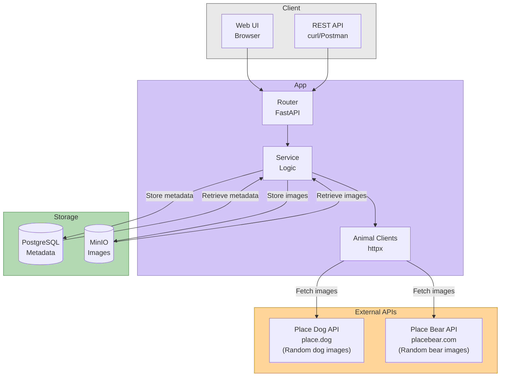

# Animal Picture Microservice

A production-ready FastAPI microservice that fetches, stores, and serves animal pictures from external APIs. Built with modern Python best practices, containerization, and Kubernetes deployment support.

[](https://www.python.org/downloads/)
[](https://fastapi.tiangolo.com/)
[](https://www.docker.com/)
[](https://helm.sh/)
[](https://hub.docker.com/r/sanket4373/animal-pics)

---

## Table of Contents

- [Background](#background)
- [Architecture](#architecture)
- [Running Application locally (Docker Compose)](#running-application-locally-docker-compose)
- [Testing](#testing)
- [Running Application in Production Deployment (Kubernetes)](#running-application-in-production-deployment-kubernetes)
- [Technology Stack](#technology-stack)
- [Features](#features)
- [Prerequisites](#prerequisites)
- [API Reference](#api-reference)

- [Project Structure](#project-structure)
- [Design Decisions](#design-decisions)
---

## Background

This microservice was built to demonstrate modern Python web development practices, cloud-native architecture patterns, and production deployment strategies. It showcases:

- **Cloud-native storage patterns** (object storage + relational database)
- **Container orchestration** with Docker Compose and Kubernetes
- **Infrastructure as Code** using Helm charts
- **Automated Testing** with pytest
- **RESTful API design** with automatic OpenAPI documentation

### Problem Statement

Fetch animal pictures from external APIs (Dog CEO API, Bear API), store them efficiently, and provide a simple interface to retrieve them. The challenge is to handle binary data correctly, support concurrent fetching, and deploy in both local and production environments.

---

## Architecture

### High-Level Architecture Diagram



### Data Flow

1. **Fetch Request**: Client sends POST `/animals/fetch` with animal type and count
2. **Concurrent Fetching**: Service layer uses `asyncio.gather()` to fetch N images in parallel from external APIs
3. **Storage**: Each image is:
   - Uploaded to MinIO object storage (binary data)
   - Metadata saved to PostgreSQL (URL, key, timestamp)
4. **Retrieval**: Client requests GET `/animals/last/{type}`
5. **Response**: Service queries PostgreSQL for metadata, retrieves image from MinIO, returns binary response

### Storage Architecture

**PostgreSQL stores:**
- `animal_type` - Type of animal (dog, bear)
- `image_url` - Original source URL
- `minio_object_key` - Key to retrieve from MinIO
- `fetched_at` - UTC timestamp

**MinIO stores:**
- Raw image bytes
- Bucket: `animal-pictures`
- Key format: `{animal_type}/{uuid4}.jpg`

---

## Running Application locally (Docker Compose)

Get the application running locally in minutes with Docker Compose. No need to install Python, Poetry, or any dependencies on your machine.

### Step 1: Clone the Repository

```bash
# Clone the repository
git clone https://github.com/sanket4373/animal-pics.git

# Navigate to the project directory
cd animal-pics
```

### Step 2: Build and Start Services

```bash
# Build and start all services
docker-compose up --build

# Or run in detached mode
docker-compose up -d --build

# View logs
docker-compose logs -f app
```

### Step 3: Verify Services

```bash
# Check running containers
docker-compose ps

# Test the health endpoint
curl http://localhost:8000/health
```

### Step 4: Access the Application

- **Web UI**: http://localhost:8000
- **API Documentation**: http://localhost:8000/docs (Swagger UI)
- **MinIO Console**: http://localhost:9001 (minioadmin/minioadmin)

### Step 5: Stop Services

```bash
# Stop and remove containers
docker-compose down

# Stop and remove containers + volumes (deletes data)
docker-compose down -v
```

## Testing

### Test Structure

```
tests/
├── conftest.py          # Fixtures (test DB, client, mocks)
├── test_api.py          # Integration tests for endpoints
└── test_service.py      # Unit tests for business logic
```

### Key Testing Features

- **In-memory SQLite** for fast test database
- **Mocked MinIO** storage (no external dependencies)
- **Mocked external APIs** using `respx`
- **Async test support** with `pytest-asyncio`
- **Fixtures** for dependency injection


```bash
# Run tests inside a container
docker-compose run --rm app python -m pytest -v

# Run without coverage
docker-compose run --rm app python -m pytest -v tests/

# Run specific test file
docker-compose run --rm app python -m pytest -v tests/test_api.py
docker-compose run --rm app python -m pytest -v tests/test_service.py

```

### What's Running?

Docker Compose starts three services automatically:

- **FastAPI Application** (Port 8000) - The main microservice
- **PostgreSQL Database** (Port 5432) - Stores metadata
- **MinIO Object Storage** (Ports 9000, 9001) - Stores images

---

## Running Application in Production Deployment (Kubernetes)

Deploy to Kubernetes in minutes using the pre-built Docker image from Docker Hub. No need to build the image yourself!

### Pre-built Docker Image

The application is available as a public Docker image on Docker Hub:

**Docker Hub Repository:** https://hub.docker.com/r/sanket4373/animal-pics

The Helm chart is configured to automatically pull the image from Docker Hub during deployment. You can also manually pull it if needed:

```bash
# Pull the latest image (optional - Helm does this automatically)
docker pull sanket4373/animal-pics:latest

# Or use a specific version
docker pull sanket4373/animal-pics:v1.0.0
```

### Prerequisites

- Access to a Kubernetes cluster (minikube, kind, GKE, EKS, AKS, or any K8s cluster)
- `kubectl` installed and configured to access your cluster
- `helm` 3.x installed ([installation guide](https://helm.sh/docs/intro/install/))

### One-Command Deployment

Deploy the complete application stack (PostgreSQL + MinIO + FastAPI) with a single command:

```bash
# Step 1: Clone the repository
git clone https://github.com/sanket4373/animal-pics.git
cd animal-pics

# Step 2: Deploy everything with ONE command
helm install animal-pics ./helm/animal-pics

# This automatically deploys:
# PostgreSQL database (postgres:15-alpine with 1Gi persistent storage)
# MinIO object storage (minio/minio:latest with 5Gi persistent storage)
# FastAPI application (pulls from Docker Hub: sanket4373/animal-pics:latest)
# All required services, configmaps, and secrets
# Health checks and readiness probes
```

### Verify Deployment

```bash
# Check all pods are running
kubectl get pods -n animal-pics

# Expected output (wait 1-2 minutes for all to be Ready):
# NAME                                    READY   STATUS    RESTARTS   AGE
# animal-pics-postgres-xxx                1/1     Running   0          2m
# animal-pics-minio-xxx                   1/1     Running   0          2m
# animal-pics-xxx                         1/1     Running   0          2m

# Check services
kubectl get svc -n animal-pics
```

### Access the Application

```bash
# Port forward to access locally
kubectl port-forward svc/animal-pics 8000:8000 -n animal-pics

# Open in browser:
# - Web UI: http://localhost:8000
# - API Docs: http://localhost:8000/docs
# - Health Check: http://localhost:8000/health
```

### Test the Application

```bash
# Fetch some dog pictures
curl -X POST http://localhost:8000/animals/fetch \
  -H "Content-Type: application/json" \
  -d '{"animal_type": "dog", "count": 3}'

# Get the last dog picture
curl http://localhost:8000/animals/last/dog --output dog.jpg
```

### Customization Options

You can customize the deployment using `--set` flags:

```bash
# Custom database password
helm install animal-pics ./helm/animal-pics \
  --set postgres.auth.password=mysecurepassword \
  --namespace animal-pics --create-namespace

# Scale up replicas
helm install animal-pics ./helm/animal-pics \
  --set replicaCount=3 \
  --namespace animal-pics --create-namespace

# Use specific image version
helm install animal-pics ./helm/animal-pics \
  --set image.tag=v1.0.0 \
  --namespace animal-pics --create-namespace

# Increase storage sizes
helm install animal-pics ./helm/animal-pics \
  --set postgres.persistence.size=5Gi \
  --set minio.persistence.size=10Gi \
  --namespace animal-pics --create-namespace
```

Or edit `helm/animal-pics/values.yaml` and upgrade:

```bash
helm upgrade animal-pics ./helm/animal-pics -n animal-pics
```

### Storage Configuration (Persistence Pattern)

The Helm chart implements an **industry-standard persistence pattern** that makes it work on **any Kubernetes cluster**, including local clusters without a StorageClass.

#### How It Works

By default, `persistence.enabled: false` in `values.yaml`, which means:

- **No PersistentVolumeClaims (PVCs)** are created
- **emptyDir volumes** are used instead (ephemeral storage)
- **Works immediately** on any cluster (minikube, kind, Docker Desktop, etc.)
- **Data is lost** when pods restart (acceptable for demos/testing)

When you have a StorageClass available (production clusters), set `persistence.enabled: true`:

```bash
# Enable persistence for production
helm install animal-pics ./helm/animal-pics \
  --set postgres.persistence.enabled=true \
  --set minio.persistence.enabled=true \
  --namespace animal-pics --create-namespace
```

Or edit `values.yaml`:

```yaml
postgres:
  persistence:
    enabled: true      # Enable persistent storage
    size: 1Gi
    storageClass: ""   # Empty = use cluster default StorageClass

minio:
  persistence:
    enabled: true      # Enable persistent storage
    size: 5Gi
    storageClass: ""   # Empty = use cluster default StorageClass
```

#### Why This Pattern?

This is the **same pattern used by Bitnami charts** and other mature Helm charts:

- **Plug-and-play**: Works on any cluster without configuration
- **Production-ready**: Supports real persistence when available
- **No manual PV creation**: Uses dynamic provisioning when StorageClass exists

#### Storage Behavior

| Scenario | persistence.enabled | Storage Type | Data Persistence | Use Case |
|----------|-------------------|--------------|------------------|----------|
| Local dev (no StorageClass) | `false` | emptyDir | Lost on pod restart | Development, demos, testing |
| Production (with StorageClass) | `true` | PVC + PV | Survives pod restarts | Production deployments |

#### Checking Your Cluster's StorageClass

```bash
# List available StorageClasses
kubectl get storageclass

# If you see output, you have a StorageClass and can enable persistence
# If empty, use the default persistence.enabled: false
```

#### Init Container for Startup Resilience

The application deployment includes an **init container** that waits for PostgreSQL to be ready before starting the main app:

```yaml
initContainers:
  - name: wait-for-postgres
    image: postgres:15-alpine
    command:
      - sh
      - -c
      - |
        until pg_isready -h animal-pics-postgresql -p 5432 -U postgres; do
          echo "Waiting for PostgreSQL to be ready..."
          sleep 2
        done
```

**Why this matters:**
- Kubernetes has no `depends_on` equivalent (unlike Docker Compose)
- Without this, the app crashes if PostgreSQL isn't ready yet
- The init container ensures proper startup ordering
- Shows understanding of production Kubernetes patterns

### Cleanup

Remove everything with one command:

```bash
# Uninstall the application and all components
helm uninstall animal-pics -n animal-pics

# Delete the namespace (optional)
kubectl delete namespace animal-pics
```

### Production Access (Optional)

For production environments, expose via LoadBalancer or Ingress:

```bash
# Option 1: LoadBalancer (cloud providers)
kubectl expose deployment animal-pics --type=LoadBalancer --port=80 --target-port=8000

# Option 2: Configure Ingress in values.yaml
# Then: helm upgrade animal-pics ./helm/animal-pics
```

### Monitoring and Debugging

```bash
# View application logs
kubectl logs -f deployment/animal-pics

# Check all resources
kubectl get all

# Check Helm release status
helm status animal-pics

# Check health endpoint
kubectl exec -it deployment/animal-pics -- curl localhost:8000/health

# Describe pod for troubleshooting
kubectl describe pod -l app=animal-pics
```

### Cleanup

```bash
# Remove all resources
helm uninstall animal-pics

# Verify cleanup
kubectl get all
```

### Helm Chart Structure

```
helm/animal-pics/
├── Chart.yaml              # Chart metadata
├── values.yaml             # Configurable values
└── templates/
    ├── deployment.yaml     # Pod specification
    ├── service.yaml        # Service definition
    ├── configmap.yaml      # Non-sensitive config
    └── secret.yaml         # Sensitive credentials
```

---

## Technology Stack

| Layer | Technology | Why This Choice |
|-------|-----------|-----------------|
| **Language** | Python 3.11+ | Modern async/await support, excellent ecosystem |
| **Web Framework** | FastAPI | Auto-generates OpenAPI docs, async-native, type-safe with Pydantic |
| **ORM** | SQLAlchemy 2.0 | Database-agnostic (SQLite for dev, PostgreSQL for prod), mature and reliable |
| **Database** | PostgreSQL 15 | Industry-standard relational DB for structured metadata |
| **Object Storage** | MinIO | S3-compatible, perfect for binary data, avoids bloating PostgreSQL |
| **HTTP Client** | httpx | Async-native, same API for external calls and testing |
| **Package Manager** | Poetry | Modern dependency management with lockfile, replaces pip + requirements.txt |
| **Containerization** | Docker + Compose | Portable deployment, ships app + dependencies as one unit |
| **Orchestration** | Kubernetes + Helm | Production-ready deployment with declarative configuration |
| **Testing** | pytest + pytest-asyncio | Standard Python testing with async support |
| **Templating** | Jinja2 | Simple HTML rendering without separate frontend build |
| **Linting** | Ruff | Fast, modern linter replacing flake8 + isort |

### Why MinIO Instead of Storing Images in PostgreSQL?

PostgreSQL **can** store binary data via `bytea` columns, but this is an **antipattern**:

- **Bloats the database** with large unstructured blobs
- **Degrades query performance** over time
- **Makes backups slow** and wasteful
- **Defeats the purpose** of a relational database

MinIO is an **object store** — the architecturally correct tool for binary files:

- **Mirrors AWS S3 + RDS pattern** used in production systems
- **Keeps PostgreSQL lean** (only structured metadata)
- **Scales independently** from the database
- **S3-compatible API** for easy cloud migration

---

## Features

- Fetch dog pictures from Dog CEO API
- Fetch bear pictures from Bear API  
- Store images in MinIO object storage (S3-compatible)
- Track fetch history in PostgreSQL
- RESTful API with automatic OpenAPI documentation
- Async concurrent fetching using `asyncio.gather()`
- Simple web UI for testing (no build step required)
- Docker Compose for local development
- Kubernetes Helm chart for production deployment
- Comprehensive test suite with mocked external dependencies
- Health check endpoint for monitoring
- Type-safe with Pydantic schemas

---

## Prerequisites

### For Local Development (Docker Compose)

- Docker 20.10+
- Docker Compose 2.0+
- OR Colima (Docker Desktop alternative for macOS)

### For Production Deployment (Kubernetes)

- kubectl
- Helm 3
- Access to a Kubernetes cluster (minikube, kind, or cloud provider)
- Container registry access (Docker Hub, GCR, ECR, etc.)

---

## API Reference

### Base URL

- Local: `http://localhost:8000`
- Docker: `http://localhost:8000`
- Kubernetes: `http://<service-ip>:8000`

### Endpoints

#### 1. Fetch Animal Pictures

```http
POST /animals/fetch
Content-Type: application/json

{
  "animal_type": "dog",
  "count": 3
}
```

**Response:**

```json
{
  "fetched": [
    {
      "id": 1,
      "animal_type": "dog",
      "image_url": "https://images.dog.ceo/breeds/hound-afghan/n02088094_1003.jpg",
      "minio_object_key": "dog/a1b2c3d4-e5f6-7890-abcd-ef1234567890.jpg",
      "fetched_at": "2026-06-15T13:45:30.123456"
    }
  ]
}
```

**Supported animal types:** `dog`, `bear`

#### 2. Get Last Picture

```http
GET /animals/last/{animal_type}
```

**Response:** Binary image data (JPEG)

**Example:**

```bash
curl http://localhost:8000/animals/last/dog --output dog.jpg
```

#### 3. Get Fetch History

```http
GET /animals/history/{animal_type}?limit=10
```

**Response:**

```json
{
  "history": [
    {
      "id": 5,
      "animal_type": "dog",
      "image_url": "https://...",
      "fetched_at": "2026-06-15T13:45:30.123456"
    }
  ]
}
```

#### 4. Health Check

```http
GET /health
```

**Response:**

```json
{
  "status": "ok"
}
```

#### 5. Web UI

```http
GET /
```

Returns HTML interface for testing the API.

### Interactive API Documentation

FastAPI automatically generates interactive API documentation:

- **Swagger UI**: http://localhost:8000/docs
- **ReDoc**: http://localhost:8000/redoc

---

### Linting and Code Quality

```bash
# Run Ruff linter in Docker
docker-compose run --rm app poetry run ruff check .

# Auto-fix issues
docker-compose run --rm app poetry run ruff check --fix .

# Format code
docker-compose run --rm app poetry run ruff format .
```

---

## Project Structure

```
animal-pics/
├── app/
│   ├── __init__.py
│   ├── main.py              # FastAPI app entrypoint
│   ├── config.py            # Settings (pydantic-settings)
│   ├── database.py          # SQLAlchemy engine + session
│   ├── models.py            # ORM models
│   ├── schemas.py           # Pydantic request/response schemas
│   ├── router.py            # API route definitions
│   ├── service.py           # Business logic layer
│   ├── animal_clients.py    # External API clients (httpx)
│   ├── storage.py           # MinIO wrapper
│   └── templates/
│       └── index.html       # Web UI
│
├── tests/
│   ├── __init__.py
│   ├── conftest.py          # Test fixtures
│   ├── test_api.py          # API integration tests
│   └── test_service.py      # Service unit tests
│
├── helm/
│   └── animal-pics/
│       ├── Chart.yaml
│       ├── values.yaml
│       └── templates/
│           ├── deployment.yaml
│           ├── service.yaml
│           ├── configmap.yaml
│           └── secret.yaml
│
├── .env.example             # Environment variable template
├── .dockerignore
├── docker-compose.yml       # Local development stack
├── Dockerfile               # Multi-stage container build
├── pyproject.toml           # Poetry dependencies
├── poetry.lock              # Locked dependencies
└── README.md
```

---

## Design Decisions

### 1. Service Layer Separation

**Why:** Keeps business logic separate from HTTP concerns. Makes testing easier and allows reusing logic across different interfaces (REST, GraphQL, CLI).

```
Router (HTTP) → Service (Logic) → Storage/Database (Persistence)
```

### 2. Multi-Stage Dockerfile

**Why:** Keeps production image small (~150MB vs ~800MB). Builder stage has Poetry and build tools; runtime stage only has the application.

```dockerfile
FROM python:3.11-slim AS builder  # Install dependencies
FROM python:3.11-slim AS runtime  # Copy only what's needed
```

### 3. Pydantic for Configuration

**Why:** Type-safe settings with validation. Reads from environment variables or `.env` file. Fails fast on misconfiguration.

```python
class Settings(BaseSettings):
    database_url: str
    minio_endpoint: str
    # Automatically reads from DATABASE_URL, MINIO_ENDPOINT env vars
```

### 4. Health Check Endpoint

**Why:** Essential for production. Used by Docker Compose, Kubernetes liveness probes, and load balancers to determine service health.

### 5. Helm Chart Included

**Why:** Demonstrates production-readiness. Helm is the standard for Kubernetes deployments. Shows understanding of cloud-native patterns.

### 6. OpenAPI Documentation

**Why:** FastAPI generates interactive docs automatically. Improves discoverability and reduces documentation burden.

---

## Acknowledgments

- [Dog CEO API](https://place.dog/) - Free dog pictures
- [Bear API](https://placebear.com/) - Bear pictures
---